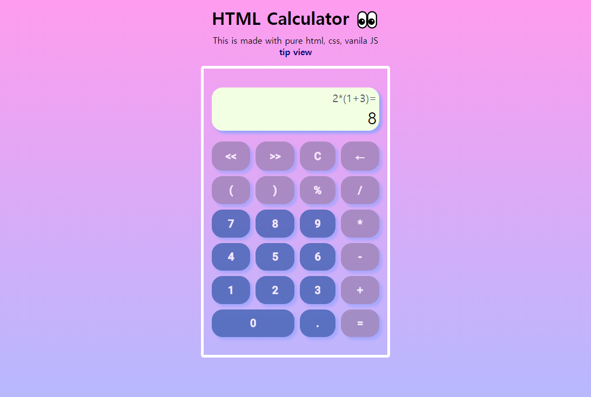

# Calculator

  

 

**순수 html, css, 바닐라 JS**로 만든 계산기 입니다.

- 지원 연산자, 숫자
  - **`+`**, **`-`**, **`*`** **`/`**, **`%`**
  - 비트연산자 (`<<`, `>>`)
  - 소수점 사용 가능
  - `(`, `)` 사용가능
  - `숫자 괄호 숫자`식에서 묵시적으로 곱셈 추가됨

- 키보드로 입력 가능
